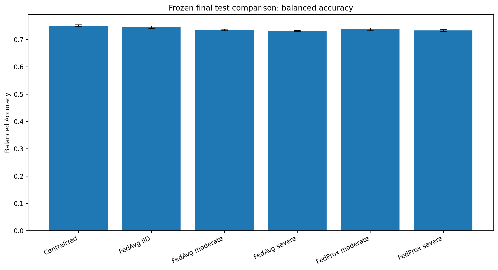
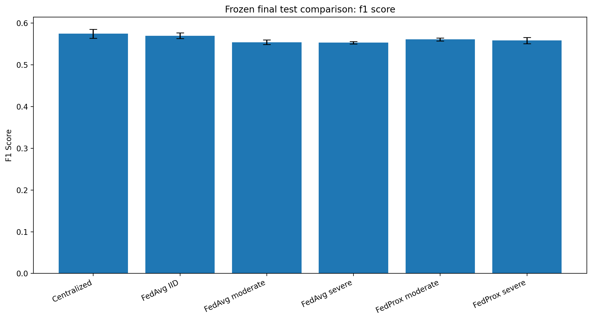

# Federated Learning for Pneumonia-Associated Lung-Opacity Classification

This repository presents an independent research study comparing **Federated Averaging (FedAvg)** and **Federated Proximal (FedProx)** for chest-radiograph classification under IID and non-IID federated-learning conditions.

The project investigates a practical challenge in federated medical artificial intelligence:

> How does increasing client heterogeneity affect federated medical-image classification, and can FedProx control client drift more effectively than FedAvg?

The study includes patient-aware data preparation, centralized and federated baselines, controlled non-IID experiments, three random seeds, validation-only model selection, a frozen final-test protocol, and a single final test evaluation.

---

## Research Title

**Evaluating FedAvg and FedProx for Federated Classification of Pneumonia-Associated Lung Opacity Under Non-IID Data**

---

## Project Overview

Medical institutions often cannot combine patient data in one central location because of privacy, governance, security, and institutional restrictions.

Federated learning offers an alternative. Multiple institutions can collaboratively train a shared model while keeping their raw data locally.

However, hospital data are rarely distributed identically. Differences may arise from:

- disease prevalence;
- patient demographics;
- imaging equipment;
- acquisition protocols;
- clinical workflows;
- institutional practices.

These differences create **non-independent and identically distributed data**, commonly called **non-IID data**.

Non-IID data can cause local models to learn in different directions, leading to client drift and weaker global-model performance.

This project compares six experimental conditions:

1. Centralized training
2. FedAvg with approximately IID clients
3. FedAvg with moderate non-IID clients
4. FedAvg with severe non-IID clients
5. FedProx with moderate non-IID clients
6. FedProx with severe non-IID clients

The federated clients in this study are simulated research clients rather than real hospitals.

---

## Research Questions

This study addresses the following questions:

1. How does federated learning compare with centralized training for pneumonia-associated lung-opacity classification?
2. How does increasing client heterogeneity affect predictive performance?
3. Does FedProx improve predictive performance compared with FedAvg?
4. Does FedProx reduce local-client and global-model update magnitudes?
5. Which evaluation metrics are most affected by increasing non-IID heterogeneity?

---

## Dataset and Provenance

This study uses the **RSNA Pneumonia Detection Challenge 2018** dataset.

Official sources:

- [RSNA Pneumonia Detection Challenge on Kaggle](https://www.kaggle.com/c/rsna-pneumonia-detection-challenge/data)
- [Official RSNA Pneumonia Detection Challenge page](https://www.rsna.org/artificial-intelligence/ai-image-challenge/rsna-pneumonia-detection-challenge-2018)

The downloaded research data included:

- `stage_2_train_images/`
- `stage_2_train_labels.csv`
- `stage_2_detailed_class_info.csv`
- the official RSNA-to-NIH image mapping file

The RSNA-to-NIH mapping was used to associate RSNA examination identifiers with the corresponding original NIH image and patient identifiers.

This mapping enabled patient-aware train, validation, and test splitting and helped prevent the same patient from appearing in more than one split.

### Verified Dataset Summary

| Item | Count |
|---|---:|
| DICOM examinations | 26,684 |
| Original patients | 11,452 |
| Negative examinations | 20,672 |
| Positive examinations | 6,012 |
| PA-view examinations | 14,511 |
| AP-view examinations | 12,173 |

The raw RSNA DICOM files are not redistributed in this repository.

Researchers must download the dataset from the official source and comply with its terms of use.

---

## Prediction Task

The study performs binary chest-radiograph classification:

- `1` — pneumonia-associated lung opacity
- `0` — no pneumonia-associated lung opacity

The positive class should not be interpreted as a definitive clinical diagnosis of pneumonia.

This project is intended only for research and educational purposes.

---

## Patient-Aware Data Splitting

The dataset was divided according to the original patient identifier.

This ensures that all examinations belonging to the same patient remain in only one split.

| Split | Images | Patients | Positive | Negative |
|---|---:|---:|---:|---:|
| Training | 18,981 | 8,148 | 4,289 | 14,692 |
| Validation | 3,841 | 1,658 | 846 | 2,995 |
| Test | 3,862 | 1,646 | 877 | 2,985 |

Verified patient overlap:

```text
Training–validation overlap: 0
Training–test overlap:       0
Validation–test overlap:     0
```

Patient-aware splitting reduces information leakage and provides a more reliable estimate of model generalization.

---

## Image Preprocessing

The preprocessing pipeline performs the following steps:

1. Read the original DICOM image.
2. Apply the DICOM rescale slope and intercept.
3. Replace non-finite pixel values.
4. Correct `MONOCHROME1` images when necessary.
5. Apply percentile-based intensity clipping.
6. Normalize pixel values to `[0, 1]`.
7. Resize images to `128 × 128`.
8. Save a lossless 16-bit PNG cache for faster training.

The final model input shape is:

```text
128 × 128 × 1
```

Only modest training augmentation was used.

Horizontal and vertical flips were not applied because they may create anatomically inappropriate chest-radiograph transformations.

---

## CNN Architecture

The same general convolutional neural network was used across the main experimental conditions.

```text
Input: 128 × 128 × 1

Convolution: 32 filters
Batch normalization
ReLU
Max pooling

Convolution: 64 filters
Batch normalization
ReLU
Max pooling

Convolution: 128 filters
Batch normalization
ReLU
Max pooling

Convolution: 256 filters
Batch normalization
ReLU

Global average pooling
Dropout: 0.30
Sigmoid output
```

Total model parameters:

```text
389,537
```

---

## Centralized Training

In centralized training, all training images are available to one model in one location.

```text
All training data
        ↓
    One CNN model
        ↓
 Centralized training
```

Centralized training does not use FedAvg or FedProx.

It is included as a reference baseline showing the performance that can be achieved when all training data are combined.

---

## Federated-Learning Design

The training data were divided among five simulated clients.

Each client trained a local model using only its assigned data.

The server then combined the client models to update the global model.

```text
Client 1 ─┐
Client 2 ─┤
Client 3 ─┼── Local training ── Server aggregation ── Global model
Client 4 ─┤
Client 5 ─┘
```

---

## FedAvg

FedAvg trains one local model on each client and calculates a sample-size-weighted average of the client model weights.

The basic process is:

1. Send the current global model to each client.
2. Train the model locally.
3. Return the updated client weights.
4. Calculate a weighted average.
5. Replace the global model weights.
6. Repeat for the next communication round.

The server aggregates the complete model weights, including batch-normalization moving statistics.

---

## FedProx

FedProx follows a similar aggregation process but adds a proximal penalty to the local training objective.

The penalty discourages the local client model from moving too far from the current global model.

This is intended to reduce client drift when the clients have heterogeneous data distributions.

The main FedProx configuration was:

```text
FedProx coefficient μ: 0.01
Clients:               5
Communication rounds:  20
Local epochs:           1
Batch size:             32
Random seeds:           11, 22, 33
```

The proximal penalty was applied only to trainable variables.

Batch-normalization moving means and variances were excluded from the proximal penalty.

---

## IID and Non-IID Partitions

Three federated partition settings were studied.

| Partition | Description |
|---|---|
| IID | Clients have approximately similar label distributions |
| Moderate non-IID | Dirichlet label partition with `α = 0.5` |
| Severe non-IID | Dirichlet label partition with `α = 0.1` |

Lower Dirichlet alpha values create stronger differences between client label distributions.

All examinations belonging to the same patient were assigned to the same federated client.

This maintained patient integrity and prevented patient overlap between clients.

---

## Experimental Configuration

The main experimental protocol used:

```text
Clients:                 5
Federated rounds:        20
Local epochs:            1
Batch size:              32
Optimizer:               Adam
Learning rate:           0.0005
Random seeds:            11, 22, 33
FedProx μ:                0.01
Primary selection metric: Validation PR-AUC
```

Class weights were calculated from the global training distribution:

```text
Negative-class weight: 0.645964
Positive-class weight: 2.212754
```

Three random seeds were used to reduce dependence on a single random initialization.

---

## Model Selection and Final-Test Protocol

Model selection was based only on validation PR-AUC.

Classification thresholds were also selected using validation data.

The test set was not used during:

- model training;
- checkpoint selection;
- threshold selection;
- hyperparameter selection;
- comparison of candidate models.

Before the final evaluation, the following items were frozen:

- 18 selected model files;
- selected checkpoints;
- validation-selected thresholds;
- validation reports;
- model SHA-256 hashes;
- report SHA-256 hashes.

The final test set was then evaluated once using the frozen protocol.

Final-test safeguards:

```text
Threshold tuned on test:       False
Model selected on test:        False
Final evaluation repeated:     False
Training–test overlap:         0
Validation–test overlap:       0
```

---

## Evaluation Metrics

The study reports:

- ROC-AUC;
- PR-AUC;
- balanced accuracy;
- F1-score;
- accuracy;
- precision;
- sensitivity;
- specificity;
- average precision;
- log loss;
- confusion-matrix counts;
- global-update L2 magnitude;
- mean client-update L2 magnitude.

PR-AUC was treated as an important metric because the positive class is less common than the negative class.

---

## Final Test Results

Results are reported as mean ± standard deviation across three random seeds.

| Condition | ROC-AUC | PR-AUC | Balanced Accuracy | F1-Score |
|---|---:|---:|---:|---:|
| **Centralized** | **0.8295 ± 0.0040** | **0.5800 ± 0.0057** | **0.7510 ± 0.0037** | **0.5745 ± 0.0107** |
| FedAvg IID | 0.8179 ± 0.0030 | 0.5605 ± 0.0042 | 0.7453 ± 0.0048 | 0.5695 ± 0.0068 |
| FedAvg moderate non-IID | 0.8131 ± 0.0027 | 0.5553 ± 0.0065 | 0.7355 ± 0.0032 | 0.5541 ± 0.0055 |
| FedAvg severe non-IID | 0.8070 ± 0.0005 | 0.5440 ± 0.0043 | 0.7312 ± 0.0020 | 0.5529 ± 0.0029 |
| FedProx moderate non-IID | 0.8112 ± 0.0020 | 0.5505 ± 0.0040 | 0.7375 ± 0.0050 | 0.5608 ± 0.0036 |
| FedProx severe non-IID | 0.8076 ± 0.0019 | 0.5428 ± 0.0092 | 0.7335 ± 0.0030 | 0.5581 ± 0.0076 |

---

## Interpretation of the Results

### Centralized Performance

Centralized training achieved the strongest overall test performance.

This was expected because the centralized model trained directly on the complete training dataset without federated client separation or aggregation.

Centralized learning is included as a performance reference, not as a privacy-preserving solution.

---

### FedAvg IID Performance

FedAvg IID was the strongest federated condition overall.

The clients had approximately similar data distributions, making the federated optimization problem easier than the moderate and severe non-IID settings.

FedAvg IID achieved:

```text
ROC-AUC:           0.8179
PR-AUC:            0.5605
Balanced accuracy: 0.7453
F1-score:          0.5695
```

---

### Effect of Non-IID Heterogeneity

Increasing client heterogeneity reduced federated performance.

The clearest decline appeared in PR-AUC.

```text
FedAvg:
Moderate non-IID PR-AUC: 0.5553
Severe non-IID PR-AUC:   0.5440

FedProx:
Moderate non-IID PR-AUC: 0.5505
Severe non-IID PR-AUC:   0.5428
```

This suggests that minority-class ranking performance is particularly sensitive to heterogeneous client distributions.

---

## FedAvg Versus FedProx

Neither FedAvg nor FedProx consistently outperformed the other across every predictive metric.

### Moderate Non-IID

| Metric | FedAvg | FedProx | Better Result |
|---|---:|---:|---|
| ROC-AUC | **0.8131** | 0.8112 | FedAvg |
| PR-AUC | **0.5553** | 0.5505 | FedAvg |
| Balanced accuracy | 0.7355 | **0.7375** | FedProx |
| F1-score | 0.5541 | **0.5608** | FedProx |

### Severe Non-IID

| Metric | FedAvg | FedProx | Better Result |
|---|---:|---:|---|
| ROC-AUC | 0.8070 | **0.8076** | FedProx, slightly |
| PR-AUC | **0.5440** | 0.5428 | FedAvg, slightly |
| Balanced accuracy | 0.7312 | **0.7335** | FedProx |
| F1-score | 0.5529 | **0.5581** | FedProx |

FedAvg achieved slightly higher PR-AUC in both non-IID conditions.

FedProx achieved slightly higher balanced accuracy and F1-score in both non-IID conditions.

The differences in predictive performance were generally small.

---

## Client-Drift Analysis

FedProx produced a clearer advantage in controlling optimization drift.

At the validation-selected checkpoints, FedProx reduced update magnitudes by approximately:

| Condition | Global-Update Reduction | Mean Client-Update Reduction |
|---|---:|---:|
| Moderate non-IID | 51.27% | 52.08% |
| Severe non-IID | 48.83% | 43.53% |

These results show that FedProx successfully constrained local-client and global-model movement.

However, the reduction in update magnitude did not consistently produce better ROC-AUC or PR-AUC on the final test set.

---

## Main Findings

The main findings are:

1. Centralized learning achieved the strongest overall predictive performance.
2. FedAvg IID was the strongest federated condition.
3. Increasing non-IID heterogeneity reduced federated performance.
4. PR-AUC was especially sensitive to increasing heterogeneity.
5. FedAvg achieved slightly higher PR-AUC than FedProx under both non-IID conditions.
6. FedProx achieved slightly higher balanced accuracy and F1-score.
7. FedProx substantially reduced client and global update magnitudes.
8. Better optimization stability did not automatically lead to better predictive generalization.
9. Neither FedAvg nor FedProx consistently dominated across all metrics.

---

## Main Conclusion

Increasing client heterogeneity progressively reduced federated classification performance, particularly PR-AUC.

FedProx with `μ = 0.01` substantially reduced local-client and global-model update magnitudes, demonstrating stronger control of client drift.

However, this optimization stability did not produce consistent improvements in final predictive ranking compared with FedAvg.

The central conclusion is:

> FedAvg and FedProx achieved broadly comparable predictive performance under non-IID conditions. FedAvg produced slightly higher PR-AUC, while FedProx provided stronger client-drift control and slightly higher balanced accuracy and F1-score.

---

## Selected Figures

### Final Test PR-AUC


### Final Test ROC-AUC


### Final Test Balanced Accuracy



### Final Test F1-Score



### Global-Update Magnitude


### Mean Client-Update Magnitude


### Preprocessing Examples


---

## Repository Structure

```text
federated-pneumonia-research/
├── README.md
├── config.py
├── requirements.txt
│
├── dataset/
│   └── rsna/
│       └── raw/
│
├── data/
│   ├── cache/
│   ├── manifests/
│   └── partitions/
│
├── experiments/
│   ├── audit_rsna.py
│   ├── build_manifest.py
│   ├── validate_preprocessing.py
│   ├── cache_images.py
│   ├── create_partitions.py
│   ├── smoke_test_pipeline.py
│   ├── train_centralized_dev.py
│   ├── train_fedavg.py
│   ├── train_fedprox.py
│   ├── summarize_fedavg.py
│   ├── summarize_fedprox.py
│   ├── compare_fedavg_conditions.py
│   ├── compare_fedavg_fedprox.py
│   ├── freeze_final_test_protocol.py
│   └── evaluate_final_test.py
│
├── src/
│   ├── data.py
│   ├── dicom.py
│   ├── model.py
│   ├── metrics.py
│   ├── partitions.py
│   ├── federated.py
│   └── fedprox.py
│
├── results/
│   ├── figures/
│   ├── tables/
│   ├── models/
│   ├── logs/
│   └── raw/
│
├── research/
├── paper/
├── proposal/
└── portfolio/
```

Raw data, cached images, large model files, personal documents, and temporary files should not be committed to GitHub.

---

## Environment

The experiments were developed using:

```text
Python:      3.10
TensorFlow:  2.21
Platform:    macOS Apple Silicon
Compute:     CPU
```

Create and activate a virtual environment:

```bash
python -m venv fed-pneumo-env
source fed-pneumo-env/bin/activate
```

Upgrade `pip` and install the dependencies:

```bash
pip install --upgrade pip
pip install -r requirements.txt
```

Conda may also be used.

---

## Dataset Setup

Download the RSNA Pneumonia Detection Challenge dataset from Kaggle.

Place the required files under:

```text
dataset/rsna/raw/
```

Expected structure:

```text
dataset/rsna/raw/
├── stage_2_train_images/
├── stage_2_train_labels.csv
├── stage_2_detailed_class_info.csv
└── pneumonia-challenge-dataset-mappings_2018.json
```

The exact mapping filename may vary depending on the download source.

---

## Reproduction Workflow

Run all commands from the repository root.

### 1. Audit the Raw Dataset

```bash
python -m experiments.audit_rsna
```

This verifies:

- image counts;
- label counts;
- duplicate rows;
- conflicting labels;
- multi-box examinations;
- view-position distributions.

### 2. Build Patient-Aware Manifests

```bash
python -m experiments.build_manifest
```

This creates patient-aware training, validation, and test manifests.

### 3. Validate DICOM Preprocessing

```bash
python -m experiments.validate_preprocessing
```

This checks preprocessing numerically and visually.

### 4. Cache the Images

```bash
python -m experiments.cache_images
```

This converts the preprocessed DICOM images into a faster lossless image cache.

### 5. Create Federated Partitions

```bash
python -m experiments.create_partitions
```

This creates IID, moderate non-IID, and severe non-IID client partitions.

### 6. Run the Pipeline Smoke Test

```bash
python -m experiments.smoke_test_pipeline
```

This verifies the data loader, model, loss, augmentation, class weights, and training pipeline.

### 7. Train Centralized Models

Use the centralized-training scripts under:

```text
experiments/
```

### 8. Train FedAvg Models

```bash
python -m experiments.train_fedavg
```

### 9. Test and Train FedProx

```bash
python -m experiments.smoke_test_fedprox
python -m experiments.train_fedprox
```

### 10. Generate Validation Comparisons

```bash
python -m experiments.compare_fedavg_conditions
python -m experiments.compare_fedavg_fedprox
```

### 11. Freeze the Final-Test Protocol

```bash
python -m experiments.freeze_final_test_protocol
```

### 12. Final-Test Evaluation

The official final-test evaluation in this repository has already been completed using a frozen one-time protocol.

The existing final results should not be overwritten or presented as newly generated results without independently repeating the complete study.

---

## Important Result Files

```text
results/tables/final_test_protocol.json
results/tables/final_test_report.json
results/tables/final_test_per_seed_results.csv
results/tables/final_test_aggregate_results.csv
results/tables/final_test_evaluation_completed.lock

results/tables/fedavg_fedprox_comparison_report.json
results/tables/fedavg_fedprox_paired_summary.csv
results/tables/fedavg_fedprox_heterogeneity_summary.csv
```

---

## Files Not Included in the Repository

The following files should not be uploaded to GitHub:

- raw RSNA DICOM images;
- cached medical images;
- large trained-model files;
- private certificates;
- transcripts;
- passport or visa documents;
- environment folders;
- temporary training logs;
- local system files;
- personal information;
- downloaded dataset archives.

These files should be excluded through `.gitignore`.

---

## Limitations

This study has several limitations:

1. The federated clients were simulated from one public dataset rather than collected from independent hospitals.
2. The non-IID settings mainly represent controlled label-distribution heterogeneity.
3. Only one FedProx coefficient, `μ = 0.01`, was evaluated in the main study.
4. The experiments used a compact custom CNN rather than a large pretrained medical-imaging model.
5. The experiments were performed using CPU-based local computing.
6. No external hospital dataset was available for independent validation.
7. The task predicts pneumonia-associated lung opacity rather than providing a complete clinical pneumonia diagnosis.
8. The study used three random seeds, which supports descriptive comparison but not strong statistical-significance claims.
9. The FedAvg and FedProx local-training implementations were not completely identical internally.
10. Communication cost, differential privacy, and secure aggregation were outside the scope of the current study.

---

## Future Work

Possible extensions include:

- external validation using independent hospital data;
- feature-skew and acquisition-skew experiments;
- multiple FedProx coefficients;
- additional local-epoch settings;
- more federated clients;
- personalized federated learning;
- client-level fairness evaluation;
- uncertainty estimation;
- probability calibration;
- communication-cost analysis;
- secure aggregation;
- differential privacy;
- adversarial-client robustness;
- stronger federated optimizers;
- pretrained medical-imaging models;
- privacy-preserving explainability;
- real multi-institutional federated evaluation.

---

## Research Materials

The repository may include the following supporting documents:

```text
paper/
    Research manuscript draft

proposal/
    Thesis proposal draft

research/
    Research notes
    Experiment documentation
    Research log

portfolio/
    Academic-project descriptions
    CV research entries
    Scholarship materials
```

The manuscript should be described as:

> Research manuscript in preparation

It should not be described as a published paper unless it has been formally accepted and published.

---

## Responsible-Use Statement

This repository is provided for research and educational purposes.

The models are not approved medical devices.

They must not be used for:

- clinical diagnosis;
- treatment decisions;
- emergency triage;
- patient management;
- independent interpretation of medical images.

Any future clinical application would require:

- external clinical validation;
- regulatory review;
- bias and fairness assessment;
- privacy and security evaluation;
- prospective testing;
- oversight by qualified medical professionals.

---

## Author

**Yohannes Alelign Biresaw**

BSc in Electrical and Computer Engineering  
Haramaya University, Ethiopia

Current research interests:

- federated learning;
- trustworthy artificial intelligence;
- medical-image analysis;
- privacy-preserving machine learning;
- cybersecurity;
- embedded systems;
- robotics.

GitHub: [john121319](https://github.com/john121319)

Email: `yohannes.sch.ca@gmail.com`

---

## Citation

This work is currently an independent research project and manuscript in preparation.

```bibtex
@unpublished{biresaw2026federated,
  author = {Yohannes Alelign Biresaw},
  title = {Evaluating FedAvg and FedProx for Federated Classification of Pneumonia-Associated Lung Opacity Under Non-IID Data},
  note = {Independent research project and manuscript in preparation},
  year = {2026}
}
```

---

## Acknowledgements

This project uses data from the RSNA Pneumonia Detection Challenge.

The author acknowledges:

- the Radiological Society of North America;
- the challenge organizers;
- the contributing radiologists;
- the National Institutes of Health;
- the researchers who created the original dataset;
- the researchers who made the annotations and mapping resources available for scientific study.