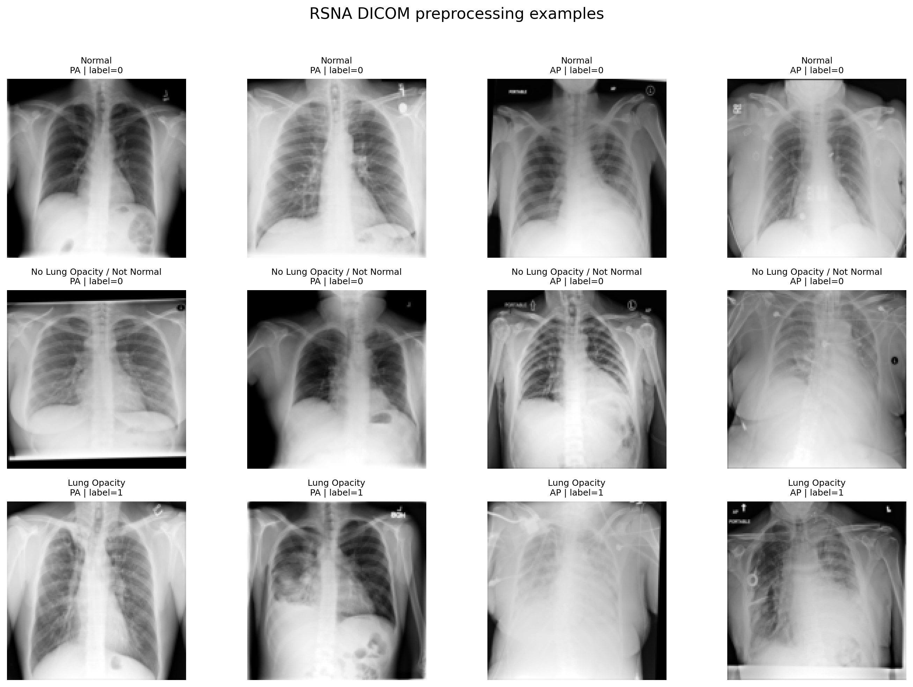
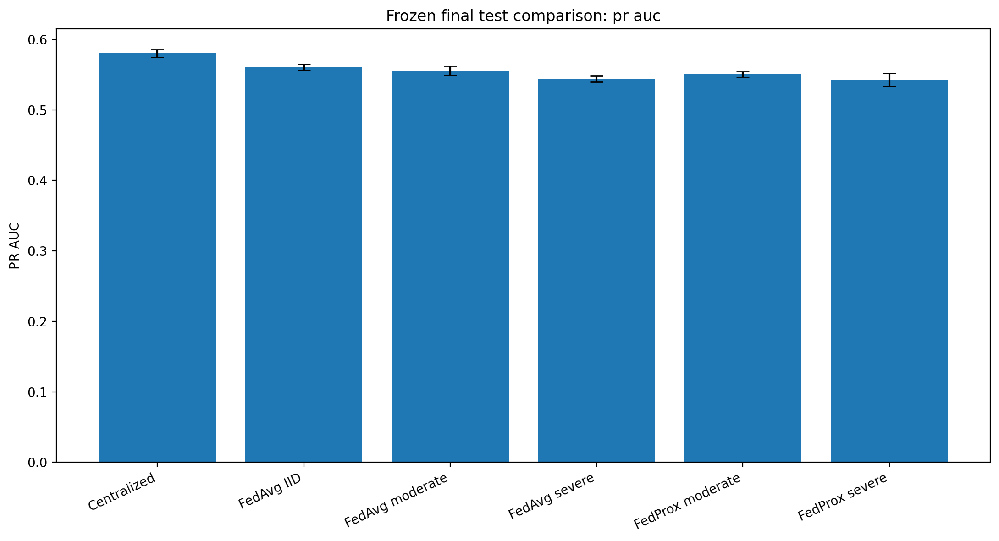
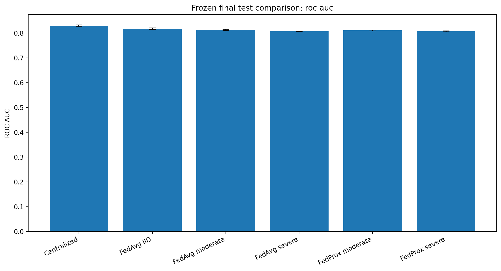
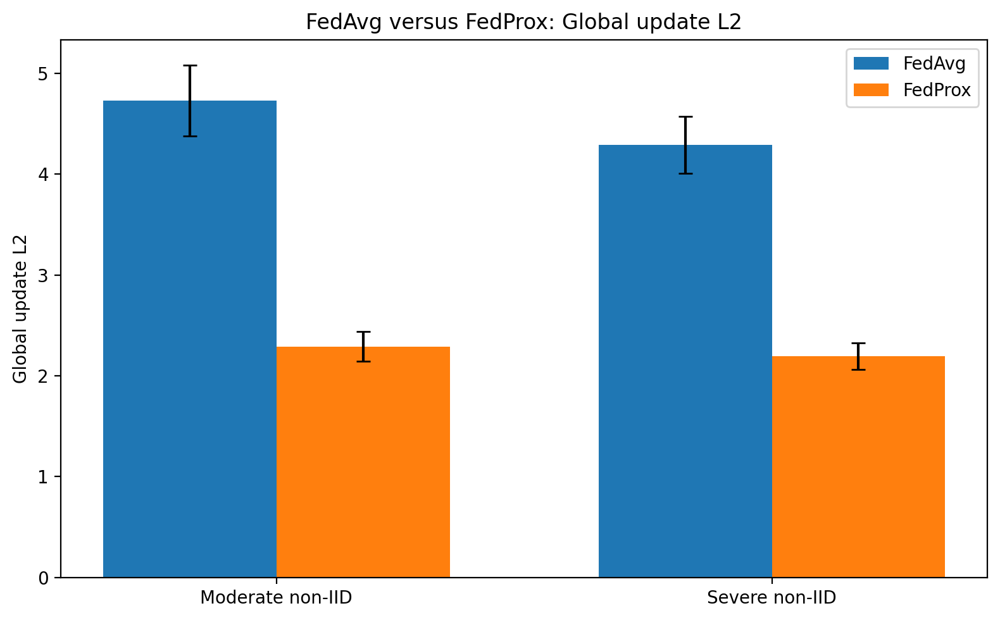
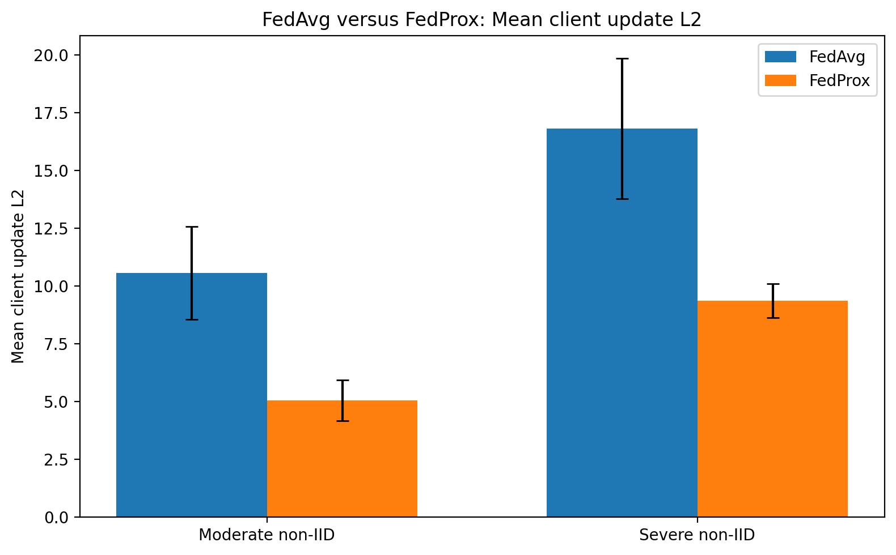

# Federated Learning Under Non-IID Client Heterogeneity for Chest-Radiograph Classification

**Author:** Yohannes Alelign Biresaw  
**Status:** Completed research project with code, aggregate results, figures, a research manuscript, and a frozen final-test protocol.

> **Research-use notice:** This repository studies pneumonia-associated lung-opacity classification from frontal chest radiographs. It is not a clinically validated diagnostic system and must not be used for patient care.

## Overview

This project evaluates how client heterogeneity changes the behaviour of federated medical-image classifiers. It compares centralized training, Federated Averaging (FedAvg), and Federated Proximal optimization (FedProx) under approximately IID, moderately non-IID, and severely non-IID client partitions.

The work emphasizes reproducibility and evaluation discipline:

- patient-exclusive train, validation, and test splits;
- patient-exclusive federated clients;
- three random seeds;
- validation-only checkpoint and threshold selection;
- direct measurement of client and global update magnitudes; and
- one frozen final evaluation of 18 selected model-threshold pairs.

### Main finding

Increasing client heterogeneity reduced federated predictive performance, especially PR-AUC. FedProx reduced best-checkpoint client and global update magnitudes by roughly one-half, but this stronger optimization control did not consistently improve held-out ROC-AUC or PR-AUC. FedAvg retained a small PR-AUC advantage, while FedProx achieved slightly higher balanced accuracy and F1-score under both non-IID conditions.

## Research questions

1. How does increasing non-IID client heterogeneity affect federated predictive performance?
2. Does FedProx reduce client drift relative to FedAvg?
3. Does lower update magnitude translate into better performance on unseen patients?
4. How does federated training compare with a centralized reference under the same patient-aware split?

## Dataset and provenance

The project uses the **RSNA Pneumonia Detection Challenge 2018** dataset.

- [Dataset on Kaggle](https://www.kaggle.com/c/rsna-pneumonia-detection-challenge/data)
- [Official RSNA challenge page and mapping resource](https://www.rsna.org/artificial-intelligence/ai-image-challenge/rsna-pneumonia-detection-challenge-2018)

| Item | Count |
|---|---:|
| Annotation rows | 30,227 |
| Unique radiographic examinations | 26,684 |
| Original patients | 11,452 |
| Positive examinations | 6,012 |
| Negative examinations | 20,672 |

The RSNA-to-NIH mapping was used to recover original patient identifiers. Raw DICOM data are not redistributed in this repository.

### Patient-aware split

| Split | Images | Patients | Positive | Negative |
| --- | ---: | ---: | ---: | ---: |
| Training | 18,981 | 8,148 | 4,289 | 14,692 |
| Validation | 3,841 | 1,658 | 846 | 2,995 |
| Test | 3,862 | 1,646 | 877 | 2,985 |

Patient overlap across the three splits is zero.

## Task definition

The project performs examination-level binary classification:

- `1`: pneumonia-associated lung opacity;
- `0`: no pneumonia-associated lung opacity.

Multiple opacity bounding-box rows for the same radiograph were collapsed into one positive examination-level label. The target is a research label and should not be interpreted as a definitive clinical diagnosis.

## Preprocessing

The pipeline applies DICOM rescale slope and intercept, replaces non-finite values, corrects `MONOCHROME1` images, clips intensities by robust percentiles, normalizes to `[0, 1]`, resizes to `128 x 128`, and stores a lossless 16-bit PNG cache.



## Model and training design

The same compact CNN was used across the primary conditions:

- four convolutional blocks with 32, 64, 128, and 256 filters;
- batch normalization and ReLU activations;
- max pooling after the first three blocks;
- global average pooling;
- dropout of `0.30`;
- sigmoid output;
- 389,537 total parameters.

| Setting | Value |
|---|---|
| Input | `128 x 128 x 1` |
| Optimizer | Adam |
| Learning rate | `0.0005` |
| Batch size | `32` |
| Federated clients | `5` |
| Communication rounds | `20` |
| Local epochs | `1` |
| Seeds | `11`, `22`, `33` |
| FedProx coefficient | `mu = 0.01` |
| Checkpoint criterion | Validation PR-AUC |
| Threshold selection | Validation Youden index |

Five simulated clients were created from the training split. The non-IID settings used Dirichlet label-skew partitions with `alpha = 0.5` and `alpha = 0.1`. All examinations from the same patient remained on the same client.

## Final frozen test results

Values are mean ± sample standard deviation across seeds 11, 22, and 33.

| Condition | ROC-AUC | PR-AUC | Balanced accuracy | F1-score |
| --- | ---: | ---: | ---: | ---: |
| Centralized | 0.8295 ± 0.0040 | 0.5800 ± 0.0057 | 0.7510 ± 0.0037 | 0.5745 ± 0.0107 |
| FedAvg IID | 0.8179 ± 0.0030 | 0.5605 ± 0.0042 | 0.7453 ± 0.0048 | 0.5695 ± 0.0068 |
| FedAvg moderate non-IID | 0.8131 ± 0.0027 | 0.5553 ± 0.0065 | 0.7355 ± 0.0032 | 0.5541 ± 0.0055 |
| FedAvg severe non-IID | 0.8070 ± 0.0005 | 0.5440 ± 0.0043 | 0.7312 ± 0.0020 | 0.5529 ± 0.0029 |
| FedProx moderate non-IID | 0.8112 ± 0.0020 | 0.5505 ± 0.0040 | 0.7375 ± 0.0050 | 0.5608 ± 0.0036 |
| FedProx severe non-IID | 0.8076 ± 0.0019 | 0.5428 ± 0.0092 | 0.7335 ± 0.0030 | 0.5581 ± 0.0076 |





## Client-drift analysis

At the validation-selected checkpoints, FedProx reduced update magnitudes substantially:

| Non-IID condition | Global-update reduction | Mean client-update reduction |
|---|---:|---:|
| Moderate (`alpha = 0.5`) | 51.27% | 52.08% |
| Severe (`alpha = 0.1`) | 48.83% | 43.53% |





## Repository structure

```text
federated-pneumonia-research/
├── README.md
├── config.py
├── requirements.txt
├── src/
├── experiments/
├── research/
├── results/
│   ├── figures/
│   └── tables/
├── paper/
├── proposal/
├── docs/
└── portfolio/
```

Raw images, cached images, large model files, raw predictions, temporary logs, environment folders, and personal documents should remain outside the public repository.

## Reproduction workflow

Run commands from the repository root.

```bash
python -m experiments.audit_rsna
python -m experiments.build_manifest
python -m experiments.validate_preprocessing
python -m experiments.cache_images
python -m experiments.create_partitions
python -m experiments.smoke_test_pipeline
```

Training and comparison modules are available under `experiments/`. Review each module's command-line options before running:

```bash
python -m experiments.train_fedavg --help
python -m experiments.train_fedprox --help
```

### Frozen final evaluation

The final test was evaluated once after model paths, model hashes, validation-report hashes, checkpoints, and validation-selected thresholds were frozen.

```text
results/tables/final_test_protocol.json
results/tables/final_test_report.json
results/tables/final_test_aggregate_results.csv
results/tables/final_test_evaluation_completed.lock
```

Do not rerun the final test to select better outcomes. Any future extension should use validation data, a newly defined independent test protocol, or an external dataset.

## Planned research extension

The next research direction is **secure and robust federated learning under heterogeneous and adversarial clients**. The central question is how robust aggregation can reject malicious updates without suppressing legitimate updates from clients whose data are naturally non-IID.

Planned topics include:

- model-poisoning and label-flipping attacks;
- coordinate-wise median, trimmed mean, Krum/Multi-Krum, geometric median, and trust-based aggregation;
- benign-client false rejection under label and view-position heterogeneity;
- worst-client performance, calibration, and attack-aware evaluation; and
- the privacy-security trade-off created when a server must inspect individual updates.

This is planned future work. The current repository contains no completed malicious-client or robust-aggregation results.

## Limitations

- Clients are simulated partitions from one public dataset, not independent hospitals.
- The main heterogeneity mechanism is label skew.
- One CNN architecture, one FedProx coefficient, one local epoch, and 20 rounds were used.
- Three seeds support descriptive comparison but not strong claims of statistical significance.
- FedAvg and FedProx used different local-training loop implementations.
- Federated learning alone does not provide formal privacy or security guarantees.

## Responsible use

This repository is intended for research and education. The models are not approved medical devices and must not be used for diagnosis, treatment, triage, or patient management.

## Citation

```bibtex
@misc{biresaw2026federatedpneumonia,
  author = {Yohannes Alelign Biresaw},
  title = {FedAvg and FedProx Under Controlled Non-IID Client Heterogeneity for Pneumonia-Associated Lung-Opacity Classification},
  year = {2026},
  howpublished = {GitHub research repository},
  url = {https://github.com/john121319/federated-pneumonia-research}
}
```

## Author

**Yohannes Alelign Biresaw**  
BSc in Electrical and Computer Engineering, Haramaya University, Ethiopia  
Research direction: secure and trustworthy distributed machine learning, with current research experience in federated medical imaging.
